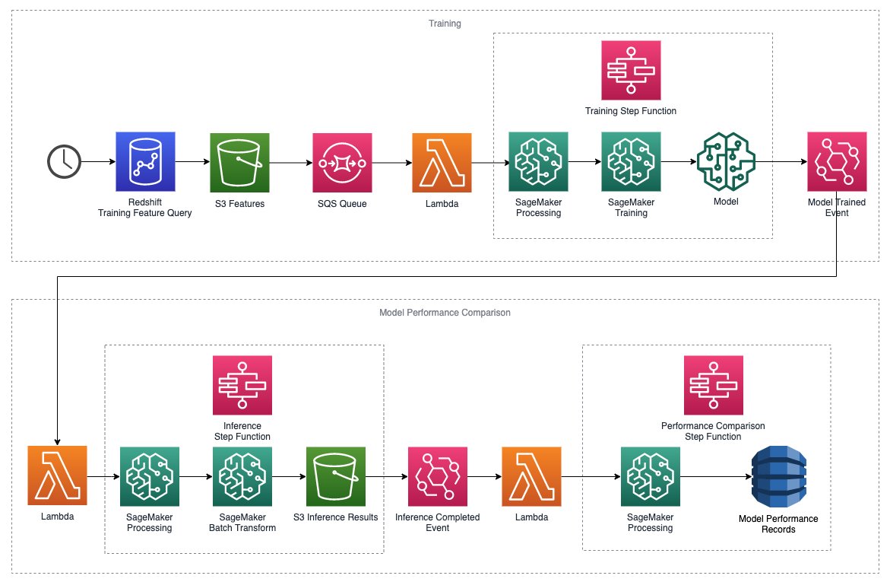
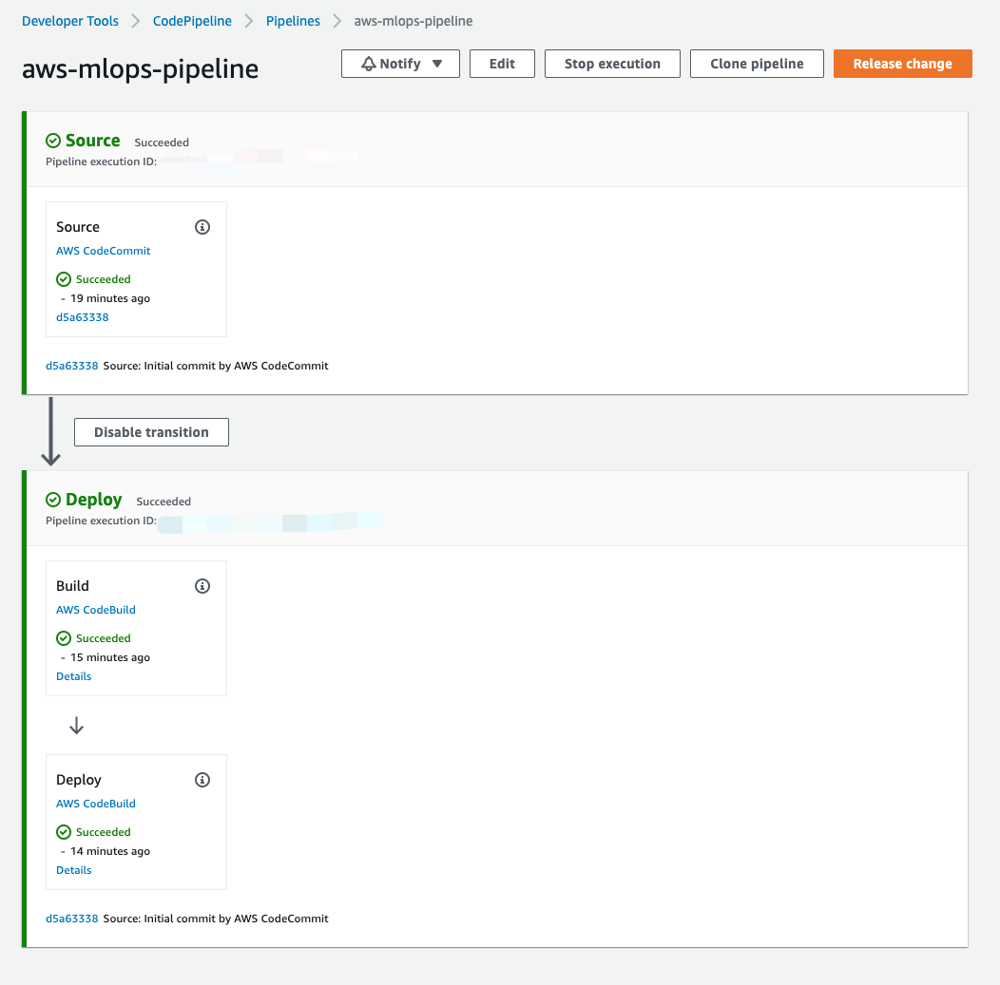

# Event-driven MLOps Pipeline on AWS

This repository contains example template that deploy the entire ML workflow including training, inference and model performance comparison.

This template is code in AWS Serverless Application Model framework. If you want to know more, please check [Doc](https://docs.aws.amazon.com/serverless-application-model/latest/developerguide/what-is-sam.html)

## Architecture Overview

### Training Workflow



### Inference Workflow


## Usage Guide

### Pre-requisite

- Clone or download this repo to local 

- Make sure you've install AWS CLI in local. If not, follow [Doc](https://docs.aws.amazon.com/cli/latest/userguide/cli-chap-install.html)

### Installation

- Visit the command in code repo root directory 
    ```ts
    cd aws-mlops-pipeline 
    ```
&nbsp;

- The following commands will create:
    - Amazon S3 Bucket to temporarily store the code before uploading them to CodeCommit
    - Amazon ECR to store the image to be consumed by Amazon SageMaker
    - AWS CodePipeline named ```aws-mlops-pipeline``` with 
        - AWS CodeCommit named as ```aws-mlops-pipeline```
        - AWS CodeBuild named ```Build``` to build image
        - AWS CodeBuild named ```Deploy``` to deploy the AWS SAM [./template.yaml](template.yaml)
    
    &nbsp;
    ```ts
    chmod +x setup.sh
    ./setup.sh
    ```
    &nbsp;
    

&nbsp;

### Sample Dataset

The original dataset we use is publicly available and was mentioned in the book [Discovering Knowledge in Data](https://www.amazon.com/dp/0470908742/) by Daniel T. Larose. It is attributed by the author to the University of California Irvine Repository of Machine Learning Datasets.

| State |Account|Length|...|Churn?|
|--|--|--|--|--|
|RI|121|827|...|False.|
|MD|134|776|...|True.|
|...|...|...|...|...|

In this solution, the original dataset is split by feature ```State``` and the state-based subsets are further separated into 3 portions (training, inference and holdout). *[Reference notebook](src/generate_dataset.ipynb)*

You could find the sample dataset in ```./src/data``` with file structure: 
```
.
├── ...
├── src
│   ├── data
│   │   ├── holdout
│   │   │   └── raw
│   │   │       ├── MD
│   │   │       │   └── MD.csv
│   │   │       └── RI
│   │   │           └── RI.csv
│   │   ├── inference
│   │   │   └── raw
│   │   │       ├── MD
│   │   │       │   └── MD.csv
│   │   │       └── RI
│   │   │           └── RI.csv
│   │   └── training
│   │       └── raw
│   │           ├── MD
│   │           │   └── MD.csv
│   │           └── RI
│   │               └── RI.csv
│   ├── ...
├── ...
```

### Trigger ML Workflow

- Visit Amazon S3 console and there will be two buckets:
  - Code Bucket: ```mlops-code-bucket-xxxxxxxx``` 
  - Data Bucket: ```mlops-data-bucket-xxxxxxxx```
- Copy all the files in ```s3://<Code Bucket>/src/data/``` to ```s3://<Data Bucket>/```
    
- Visit AWS Step Function console and you should be able to notice 4 state machine executions (2 training and 2 inference)
    


## Security

See [CONTRIBUTING](CONTRIBUTING.md#security-issue-notifications) for more information.

## License

This library is licensed under the MIT-0 License. See the LICENSE file.

